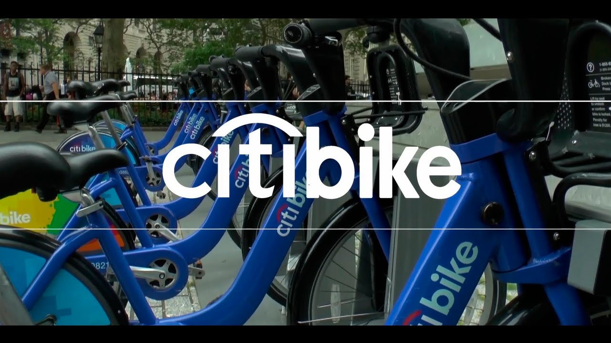

# Tableau-Citi-bike-analytics

## Background
Citi Bike is the nation's largest bike share program, with 14,500 bikes and nearly 900 stations across Manhattan, Brooklyn, Queens and Jersey City. It was designed for quick trips with convenience in mind, and it’s a fun and affordable way to get around town

## Demo
https://public.tableau.com/profile/ruben.benitez#!/vizhome/CitiBikeAnalytics_15904501780560/Story?publish=yes

## Technology Used

